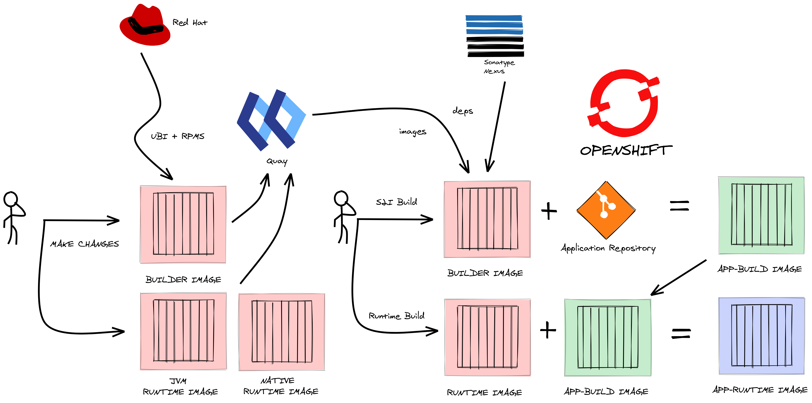

[](https://github.com/eformat/ubi-mvn-builder/actions/workflows/build_container.yaml)

## ubi-mvn-builder

Build JVM and Native Quarkus based application images from UBI using multi-stage docker files and latest Java toolchain.



> 👷👷👷 Build Toolchain:
>   - Quarkus (native and fast-jar)
>   - OpenJDK 17, maven 3.8, Mandrel 22
>   - UBI 9 Minimal
>
> ⚡⚡⚡ Runtime:
>   - UBI 9 Minimal
>   - Your Application
>
> 🐒🐒🐒 Why do this ?
>   - Latest Java toolchain
>   - A [Secure Supply Chain](https://www.redhat.com/en/blog/architecting-containers-part-5-building-secure-and-manageable-container-software-supply-chain)
>   - Smaller image sizes, less attack surface:
>       - Builder image size            = 557 MiB
>       - JVM runtime image size        = 131 MiB
>       - JVM application image size    = 143 MiB
>       - Native runtime image size     = 47 MiB
>       - Native application image size = 75 MiB

1. Create the base s2i core build image and push to remote repo for reuse across clusters.

    ```bash
    podman build --squash -t quay.io/eformat/ubi-mvn-builder:latest -f builder/Dockerfile
    podman push quay.io/eformat/ubi-mvn-builder:latest
    ```

2. Create the runtimes and push to remote repo for reuse across clusters.

    `JVM fast-jar`
    ```bash
    podman build --squash -t quay.io/eformat/ubi-mvn-runtime-jvm:latest -f runtime/Dockerfile.jvm
    podman push quay.io/eformat/ubi-mvn-runtime-jvm:latest
    ```

    `Native binary`
    ```bash
    podman build --squash -t quay.io/eformat/ubi-mvn-runtime-native:latest -f runtime/Dockerfile.native
    podman push quay.io/eformat/ubi-mvn-runtime-native:latest
    ```

3. Login to OpenShift, create a project then create the s2i build for your applications.

    ```bash
    oc new-project demo
    ```

    `JVM fast-jar`
    ```bash
    oc new-build --name=jvm-build \
      quay.io/eformat/ubi-mvn-builder:latest~https://github.com/eformat/code-with-quarkus \
      -e MAVEN_BUILD_OPTS="-Dquarkus.package.type=fast-jar -DskipTests" \
      -e MAVEN_CLEAR_REPO="true"
    ```

    `Native binary`
    ```bash
    oc new-build --name=native-build \
      quay.io/eformat/ubi-mvn-builder:latest~https://github.com/eformat/code-with-quarkus \
      -e MAVEN_CLEAR_REPO="true"
    ```

4. Build runtime Applications.

    `JVM fast-jar`
    ```bash
    oc new-build --name=jvm \
      --build-arg BUILD_IMAGE=image-registry.openshift-image-registry.svc:5000/$(oc project -q)/jvm-build:latest \
      --strategy docker --dockerfile - < ./application/Dockerfile.jvm
    ```

    `Native binary`
    ```bash
    oc new-build --name=native \
      --build-arg BUILD_IMAGE=image-registry.openshift-image-registry.svc:5000/$(oc project -q)/native-build:latest \
      --strategy docker --dockerfile - < ./application/Dockerfile.native
    ```

5. Deploy Applications.

    `JVM fast-jar`
    ```bash
    oc new-app jvm
    oc expose svc/jvm
    oc patch route/jvm \
      --type=json -p '[{"op":"add", "path":"/spec/tls", "value":{"termination":"edge","insecureEdgeTerminationPolicy":"Redirect"}}]'
    ```

    `Native binary`
    ```bash
    oc new-app native
    oc expose svc/native
    oc patch route/native \
      --type=json -p '[{"op":"add", "path":"/spec/tls", "value":{"termination":"edge","insecureEdgeTerminationPolicy":"Redirect"}}]'
    ```

6. Test.

    ```bash
    curl -w'\n' https://$(oc get route jvm --template='{{ .spec.host }}')/hello
    Hello RESTEasy Reactive

    curl -w'\n' https://$(oc get route native --template='{{ .spec.host }}')/hello
    Hello RESTEasy Reactive
    ```

### Triggers and Web Hooks

Set triggers for the application builds based on the intermediary build images:
```bash
oc set triggers bc/jvm --from-image=$(oc project -q)/jvm-build:latest
oc set triggers bc/native --from-image=$(oc project -q)/native-build:latest
```

Tag a new builder image manually:
```bash
oc tag --source=docker quay.io/eformat/ubi-mvn-builder:latest $(oc project -q)/ubi-mvn-builder:latest --reference-policy=local --insecure=true
```

Add the `--scheduled=true` argument to periodically check imported image from the remote repository.

This will Trigger new builds for s2i `jvm-build` and `native-build`.

Tag a new runtime image manually:
```bash
oc tag --source=docker quay.io/eformat/ubi-mvn-runtime-jvm:latest $(oc project -q)/ubi-mvn-runtime-jvm:latest --reference-policy=local --insecure=true
oc tag --source=docker quay.io/eformat/ubi-mvn-runtime-native:latest $(oc project -q)/ubi-mvn-runtime-native:latest --reference-policy=local --insecure=true
```

Add the `--scheduled=true` argument to periodically check imported image from the remote repository.

This will Trigger new builds for application `jvm` and `native`.

Configure a Build trigger in GitHub to start a build when the source code changes. Handy one-liner to get the hook:
```bash
APP_NAME=jvm
echo $(oc describe bc ${APP_NAME} | grep -E 'webhook.*github' | awk '{print $2}' | sed s/\<secret\>/$(oc get bc ${APP_NAME} -o jsonpath='{.spec.triggers..github.secret}')/)
```

### Options to Maven Build

```bash
| Env Variable             | Example                                      | Description                                         |
|--------------------------|----------------------------------------------|-----------------------------------------------------|
| HTTPS_PROXY              |                                              | https proxy host                                    |
| HTTP_PROXY_HOST          |                                              | http proxy host                                     |
| HTTP_PROXY_PORT          |                                              | http proxy port                                     |
| HTTP_PROXY_PASSWORD      |                                              | http proxy password                                 |
| HTTP_PROXY_USERNAME      |                                              | http proxy username                                 |
| HTTP_PROXY_NONPROXYHOSTS |                                              | http non proxy hosts                                |
| MAVEN_MIRROR_URL         | http://nexus:8081/repository/maven-public    | Default see - settings.xml. Set nexus repo mirror   |
| MAVEN_BUILD_OPTS         | "-Dquarkus.package.type=fast-jar -DskipTests"| Default build option is a Quarkus native image      |
| MAVEN_CLEAR_REPO         | "true"                                       | Deletes the .m2 repo after the build                |
```

If you experience OOM issues with the native build, you can set the max heap size in _MVN_ADDITIONAL_ARGS_ on the BuildConfig:

```bash
  strategy:
    type: Source
    sourceStrategy:
      from:
        kind: ImageStreamTag
        name: 'ubi-mvn-builder:latest'
      env:
        - name: MVN_ADDITIONAL_ARGS
          value: '-Dquarkus.native.additional-build-args=-J-Xmx2G'
```

### 🤠 For the impatient 🤠

Skip the base building, get straight to the action. Copy-n-paste this altogether into your shell. Go get a cup of coffee.

```bash
oc new-project demo
oc new-build --name=jvm-build \
  quay.io/eformat/ubi-mvn-builder:latest~https://github.com/eformat/code-with-quarkus \
  -e MAVEN_BUILD_OPTS="-Dquarkus.package.type=fast-jar -DskipTests" \
  -e MAVEN_CLEAR_REPO="true"
oc new-build --name=native-build \
  quay.io/eformat/ubi-mvn-builder:latest~https://github.com/eformat/code-with-quarkus \
  -e MAVEN_CLEAR_REPO="true"
oc new-build --name=jvm \
  --build-arg BUILD_IMAGE=image-registry.openshift-image-registry.svc:5000/$(oc project -q)/jvm-build:latest \
  --strategy docker --dockerfile - < ./application/Dockerfile.jvm
oc new-build --name=native \
  --build-arg BUILD_IMAGE=image-registry.openshift-image-registry.svc:5000/$(oc project -q)/native-build:latest \
  --strategy docker --dockerfile - < ./application/Dockerfile.native
oc set triggers bc/jvm --from-image=$(oc project -q)/jvm-build:latest
oc set triggers bc/native --from-image=$(oc project -q)/native-build:latest
oc new-app jvm --allow-missing-imagestream-tags=true
oc expose deployment/jvm --port=8080,8443
oc expose svc/jvm --port=8080
oc patch route/jvm \
  --type=json -p '[{"op":"add", "path":"/spec/tls", "value":{"termination":"edge","insecureEdgeTerminationPolicy":"Redirect"}}]'
oc new-app native --allow-missing-imagestream-tags=true
oc expose deployment/native --port=8080,8443
oc expose svc/native --port=8080
oc patch route/native \
   --type=json -p '[{"op":"add", "path":"/spec/tls", "value":{"termination":"edge","insecureEdgeTerminationPolicy":"Redirect"}}]'
```
